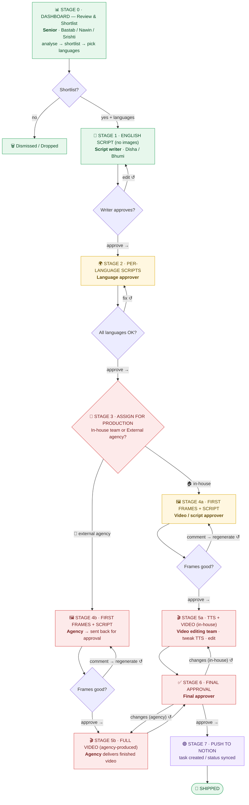

# Ad Studio — Production Workflow

> **Status:** target / ideal flow, agreed 2026-06-13. This is the source-of-truth map of the
> end-to-end production pipeline — what each stage is, who owns it, what gates it forward, and
> **what's built vs. still to build**. Read this before building any piece so you always know
> *which part of the flow you're touching and what it has to do*.

A shortlisted competitor ad flows left-to-right through gated stages. Every stage has an **owner**
who reviews and **moves it to the next stage**; most stages also have a **rework loop** (↺) so work
can bounce back without restarting. After the scripts are approved the flow **forks** by who
produces the video — the **in-house team** or an **external agency** — and the two lanes re-converge
at final approval before the task is pushed to **Notion** and shipped.

## Legend

🟢 **Built** &nbsp;·&nbsp; 🟡 **Partial / needs UX** &nbsp;·&nbsp; 🔴 **Net-new** &nbsp;·&nbsp; 🟣 **Notion** &nbsp;·&nbsp; ↺ **rework loop**

## The flow



## Stages at a glance

| # | Stage | Owner | Advances when | Rework loop | Build status |
|---|-------|-------|---------------|-------------|--------------|
| **0** | Dashboard · Review & Shortlist | Senior — **Bastab / Nawin / Srishti** | Shortlisted **+ languages picked** | — | 🟢 Built |
| **1** | English Script *(no images)* | Script writer — **Disha / Bhumi** | Writer approves | edit ↺ | 🟢 Built |
| **2** | Per-Language Scripts | Language approver | All languages approved | fix ↺ | 🟡 Partial |
| **3** | **Assign for Production** | Producer / senior | Routed → in-house or agency | — | 🔴 Net-new |
| **4a** | First Frames + Script *(in-house)* | Video / script approver | Frames approved | comment → regenerate ↺ | 🟡 Partial |
| **5a** | TTS + Video *(in-house)* | Video editing team | Video done | edit ↺ | 🔴 Net-new |
| **4b** | First Frames + Script *(agency)* | Agency → approver | Frames approved | comment → regenerate ↺ | 🔴 Net-new |
| **5b** | Full Video *(agency)* | External agency | Video delivered | revisions ↺ | 🔴 Net-new |
| **6** | Final Approval | Final approver | Approved | changes ↺ → 5a / 5b | 🔴 Net-new |
| **7** | Push to Notion → Ship | (system) | Approved | — | 🔴 Net-new |

## Stage detail

- **Stage 0 — Dashboard · Review & Shortlist.** A senior (Bastab / Nawin / Srishti) browses all
  competitor videos, analyses the data, and shortlists winners. At shortlist they also decide
  **replication + which languages** the ad gets replicated into. Moving forward = shortlisted with
  languages set. (Not shortlisted → *Dismissed / Dropped*, out of pipeline.)
- **Stage 1 — English Script.** The English Supernova script is generated **scripts only, no
  images**. The script writer (Disha / Bhumi) reviews and quickly edits, then approves.
- **Stage 2 — Per-Language Scripts.** A script is generated for each chosen language. The language
  approver checks each one and approves. Forward = **all** languages approved.
- **Stage 3 — Assign for Production.** The approved script is routed to either the **in-house team**
  or an **external agency**. This is the fork; both lanes still do a first-frame approval, then
  diverge on how the video is produced.
- **Stage 4a / 4b — First Frames + Script.** First-frame images are generated alongside the script.
  The approver reviews; **comments trigger a regenerate loop**; once satisfied, approve. (In-house
  and agency each have their own first-frame approval.)
- **Stage 5a — TTS + Video (in-house).** TTS + video are generated and the job is assigned to the
  **video editing team**, who tweak the TTS and edit the video. Done → final approval.
- **Stage 5b — Full Video (agency).** The external agency produces the **complete finished video**
  end-to-end and delivers it back. Revisions loop until delivered. Done → final approval.
- **Stage 6 — Final Approval.** The final approver reviews the finished video from either lane.
  Changes bounce back to the relevant video stage (5a / 5b); approval moves it ahead.
- **Stage 7 — Push to Notion → Ship.** On final approval the task is pushed to **Notion**
  (created / status-synced) and the ad is **shipped**.

## The in-house vs. external-agency fork

Both lanes share the *first-frame → approval* step, then diverge on who makes the video:

- **🏠 In-house** runs the internal pipeline: first frames → approval → **TTS + video generation** →
  the **video editing team** tweaks TTS and edits → final approval.
- **🏢 External agency** does first frames → approval → then the agency **produces the full video
  off-platform** and sends the finished cut back → final approval.

Both re-converge at **Stage 6 (Final Approval)**; only on approval does it **push to Notion** and ship.

## What's built vs. net-new

- 🟢 **Stages 0–2** already run in the Ad Studio webapp today (shortlist + language picker, English
  script generation + approval, per-language script generation).
- 🟡 **Needs UX:** Stage 2's per-language sign-off is a *verify chip*, not a real stage-gate. Stage
  4a extracts first frames but has **no comment → regenerate** review loop yet.
- 🔴 **Net-new:** the in-house↔agency **routing** (Stage 3); the **agency lane** end-to-end (external
  handoff + tracking the returned deliverable); **in-house TTS / video generation** (Stage 5a); the
  **final-approval** gate (Stage 6); and the **Notion push** (Stage 7).

## Where this maps in the current webapp

Today the tracker uses these statuses (`webapp/frontend/src/format.ts` → `STATUS_MAP` / `STATUS_FLOW`,
backend `webapp/backend/api_jobs.py` → `TRACKER_STATUSES`):

```
shortlisted → generating → script_ready → in_edit → approved → in_production → shipped
                                                              ( + dismissed / dropped )
```

The target flow above is a **finer-grained, explicitly-gated** version of that. Key code touchpoints:

- **Stage / status model:** `webapp/frontend/src/format.ts`, `webapp/backend/api_jobs.py`, schema in `webapp/backend/db.py` (`tracker` table).
- **Job kinds + steps** (`generate`, `localize`, `pipeline`): `webapp/backend/jobs.py` (`STEPS_VIDEO` / `STEPS_IMAGE` / `STEPS_LOCALIZE`, `run_step()`).
- **Per-language scripts** (Doc chips + verify state): `webapp/backend/jobs.py` (`_tracker_on_localize()`), `webapp/frontend/src/components/LocalizedDocsChips.tsx`, fields `tracker.localization_gdoc_urls` / `tracker.verified_languages`.
- **First-frame extraction:** `facebook/scripts/step4_frames.py` (today embedded in the `.docx`, not a review surface).

## Open questions

- **Agency & first frames:** currently drawn as the agency **making their own** first frames and
  sending them back. If instead we **hand them our generated frames**, Stage 4b changes.
- **Notion:** integration token still pending (the long-standing blocker); needed for Stage 7.
- **Stage 2 gate:** decide whether per-language approval stays a verify-chip or becomes a real
  blocking stage move.
- **Owners:** confirm who owns Stage 3 (assignment) and Stage 6 (final approval).
